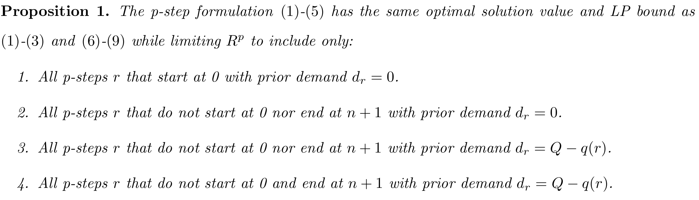

## P-step

### Definition

A p-step is defined as follows.

$$
r = (P_r, d_r).
$$

- $P_r$: an elementary path in $G$ such that
  1. it traverses exactly $p$ arcs, thus visiting $p+1$ nodes,
  2. if it starts at depot $0$, it traverses at most $p$ arcs.
- $d_r$: cumulative demand on a route prior to arriving at the first location on $P_r$ 
- $q(r)$: total demand of the customers visited on p-step $r$

### Feasibility

$$
0 \le d_r + q(r) \le Q.
$$

### Concatenation

For two consecutive p-steps $r$ and $s$, the concatenation condition is

$$
v_p(r) = v_0(s),
$$

and the carried load must also be consistent:

$$
d_r + q(r) = d_s + q_{v_0(s)},
$$

where $v_i(r)$ denotes the $i$-th node in p-step $r$.

---

## Set, parameter, and variables

### Sets

$N' = \{1,\ldots,n\},$ customer node set.
$R^p =$ set of all feasible p-steps.

### Parameters

$$
a_r^i =
\begin{cases}
2 & \text{if } i \text{ is an internal node in } P_r,\\
1 & \text{if customer } i \text{ is a boundary node on } P_r,\\
0 & \text{otherwise,}
\end{cases}
$$

$$
e_r^i =
\begin{cases}
1 & \text{if } i \text{ is the first node in } P_r,\\
-1 & \text{if } i \text{ is the last node on } P_r,\\
0 & \text{otherwise,}
\end{cases}
$$

$$
q_r^i =
\begin{cases}
d_r + q_i & \text{if } i \text{ is the first node in } P_r,\\
-d_r - q(r) & \text{if } i \text{ is the last node on } P_r,\\
0 & \text{otherwise.}
\end{cases}
$$

### Decision variable

$$
x_r =
\begin{cases}
1 & \text{if p-step } r \text{ is used},\\
0 & \text{otherwise.}
\end{cases}
$$

### Formulation

$$
\min \sum_{r \in R^p} c_r x_r
\tag{1}
$$

$$
\sum_{r \in R^p} a_r^i x_r = 2
\qquad \forall i \in N'
\tag{2}
$$

$$
\sum_{r \in R^p} e_r^i x_r = 0
\qquad \forall i \in N'
\tag{3}
$$

$$
\sum_{r \in R^p} q_r^i x_r = 0
\qquad \forall i \in N'
\tag{4}
$$

$$
x_r \in \{0,1\}
\qquad \forall r \in R^p
\tag{5}
$$

---

## Compact formulation

- The prior demand $d_r$ is continuous. $\to$ the number of p-steps in $R^p$ is infinite.

- Use finite p-steps with $d_{\min}$ / $d_{\max}$. $\to$ other p-steps are represented as convex combinations of the extreme points.

- Let $b_{ij}^r$ indicates whether arc $(i,j) \in A$ is used by p-step $r$. Then the compact formulation introduces arc variables $\theta_{ij}$.

$$
\sum_{r \in R^p} q_r^i x_r \ge 0
\qquad \forall i \in N'
\tag{6}
$$

$$
\sum_{r \in R^p} b_{ij}^r x_r = \theta_{ij}
\qquad \forall (i,j) \in A
\tag{7}
$$

$$
x_r \ge 0
\qquad \forall r \in R^p
\tag{8}
$$

$$
\theta_{ij} \in \{0,1\}
\qquad \forall (i,j) \in A
\tag{9}
$$

- Number of variables and constraints: $O\!\left(n^{p+1}\right)$

## Proposition

