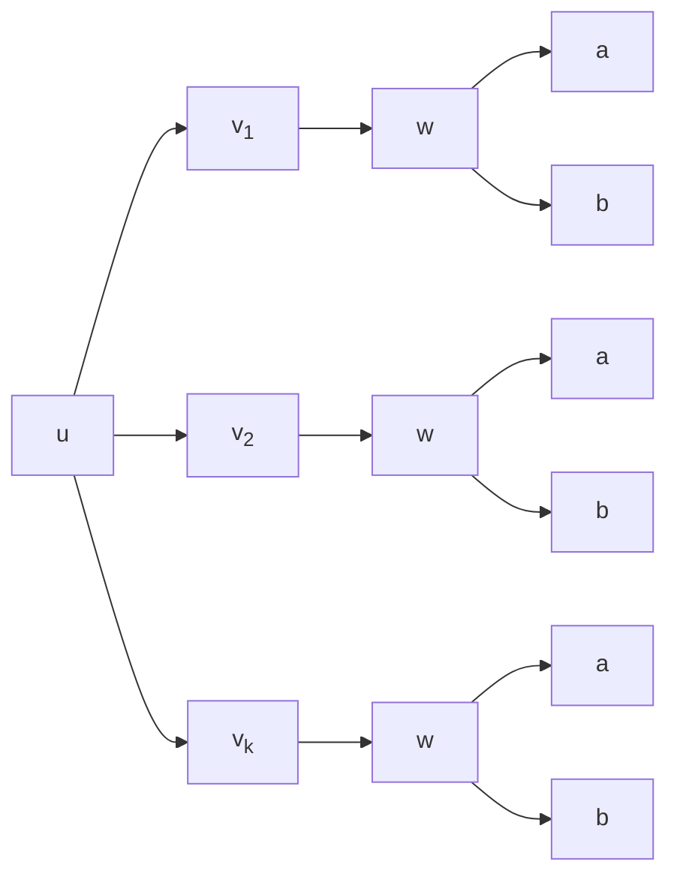
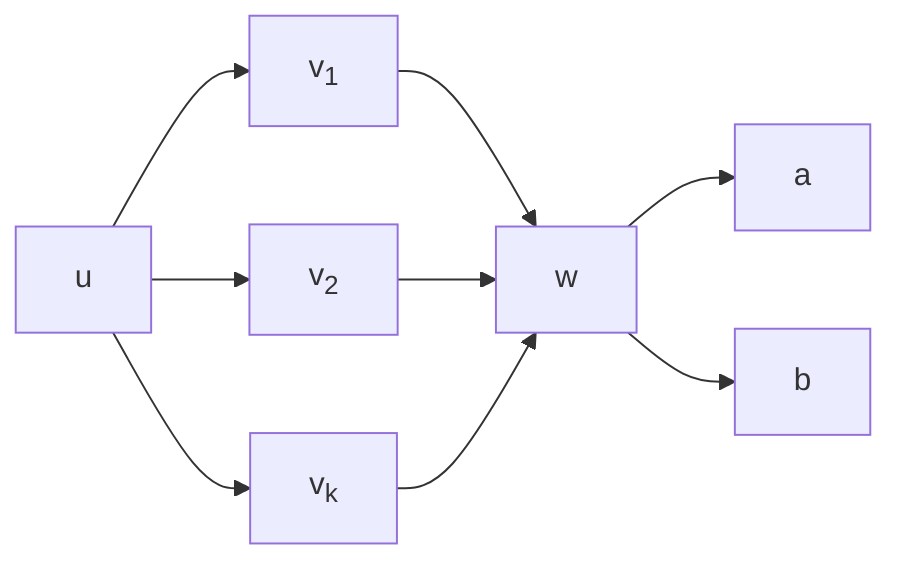
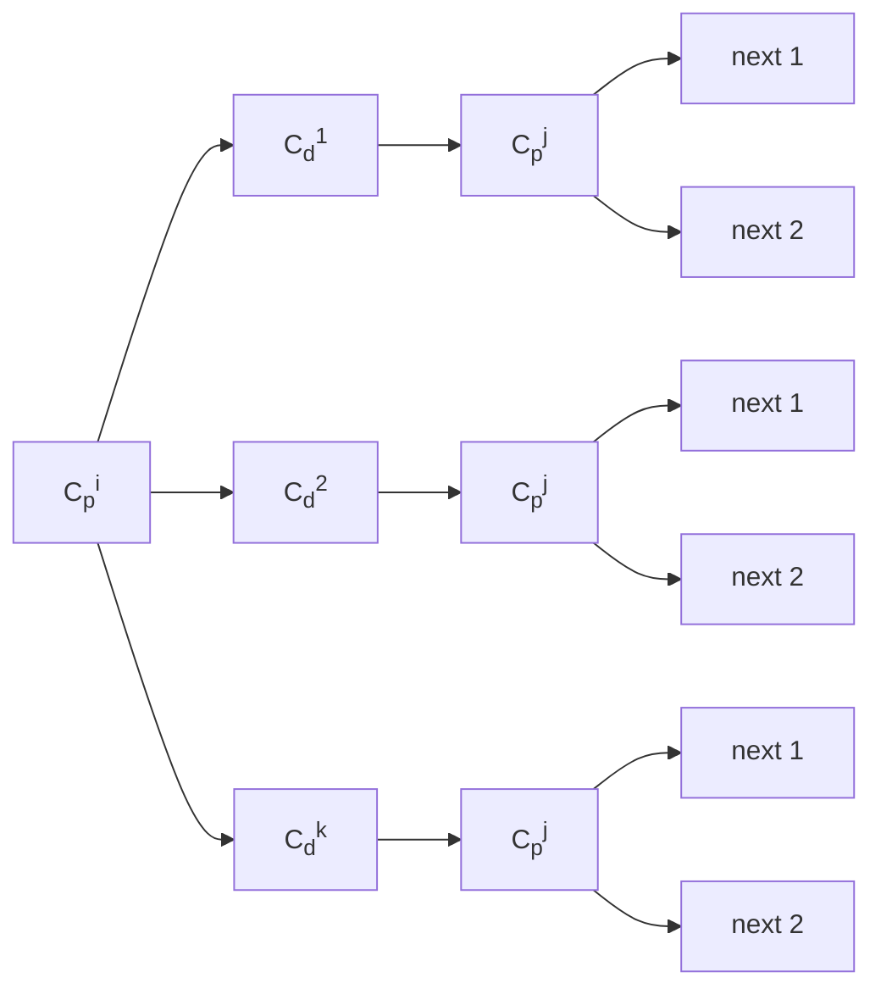
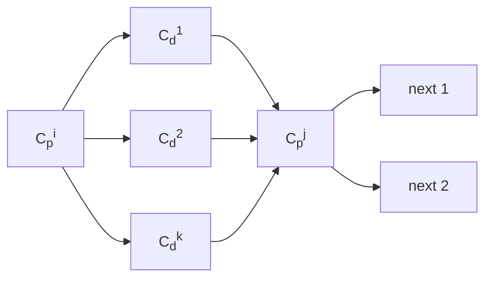
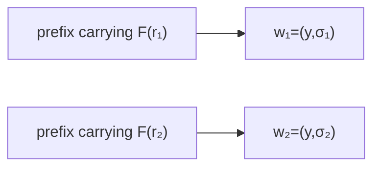
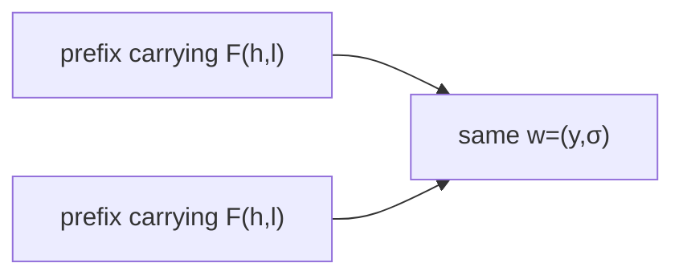

# Why p-step pricing can be easier than route-based pricing

## Core idea

The main advantage of p-step pricing is not only that each labeling problem is shorter.

The more important point is:

> route-based labeling repeatedly extends many different prefixes that reach the same intermediate node-state,  
> whereas p-step pricing can reuse one local subproblem starting from that node-state.

So the benefit comes from **removing duplicated suffix extensions**.

---

## 1. Route-based labeling

Suppose we are in the 2-step case, and many different prefixes reach the same node-state

$$
w=(y,\sigma(y)).
$$

For example,

$$
u \to v_1 \to w,\qquad
u \to v_2 \to w,\qquad
\dots,\qquad
u \to v_k \to w,
$$

where $u,v_1,\dots,v_k,w$ are all node-state pairs.

In route-based pricing, these are still different labels, because they have different prefix histories.

Therefore, the future extension from $w$ must be carried out separately for

$$
u \to v_1 \to w,\quad
u \to v_2 \to w,\quad
\dots,\quad
u \to v_k \to w.
$$

Hence the suffix computation after $w$ is repeated $k$ times.

Here the same downstream edges

$$
w \to a,\qquad w \to b
$$

are generated again after each distinct prefix label ending at $w$.

---

## 2. p-step pricing

In p-step pricing, once a segment ends at

$$
w=(y,\sigma(y)),
$$

the past prefix is not extended further inside the same labeling problem.

Instead, pricing solves a new local p-step problem **starting from $w$**.

So the downstream extensions from $w$ are generated once and can be reused by all predecessor segments that end at $w$.

Thus:

$$
\text{route-based: repeated suffix extension}
$$

versus

$$
\text{p-step: one local extension from } w \text{ + reuse}.
$$

This is the main reason p-step pricing can be easier.

So the downstream edges from $w$ are generated once and then reused by all predecessor segments ending at $w$.

---

## 3. Example: $C_p^i \to C_d^1,\dots,C_d^k \to C_p^j$

Suppose many different delivery node-states with same container type to $C_p^i$

$$
C_d^1,\dots,C_d^k
$$

all lead to the same pickup node-state

$$
C_p^j.
$$

Then in route-based labeling, the suffix starting from $C_p^j$ is extended separately for

$$
C_p^i \to C_d^1 \to C_p^j,
\quad
C_p^i \to C_d^2 \to C_p^j,
\quad
\dots,
\quad
C_p^i \to C_d^k \to C_p^j.
$$

So if there are many possible continuations from $C_p^j$, they are repeatedly recomputed after every prefix.

In contrast, in p-step pricing, once the segment reaches

$$
C_p^j,
$$

the next p-step subproblem is simply

$$
\text{all feasible p-steps starting from } C_p^j.
$$

This local subproblem is generated once and can be combined in the master problem with all predecessor segments ending at $C_p^j$.

Therefore, the more predecessors merge into the same node-state, the larger the reuse effect.

The first picture shows duplicated extension after the three different prefixes ending at $C_p^j$.  
The second picture shows that p-step pricing keeps only one downstream local subproblem from $C_p^j$.

---

## 4. When is the benefit large?

The benefit of p-step pricing is large when many different prefixes merge into the same intermediate node-state.

In other words, it is favorable when

$$
u \to v_1 \to w,\quad
u \to v_2 \to w,\quad
\dots,\quad
u \to v_k \to w
$$

exist for large $k$ with the same endpoint

$$
w=(y,\sigma(y)).
$$

Then route-based pricing repeats the suffix extension many times, while p-step pricing reuses one local problem from $w$.

So the gain of p-step pricing becomes larger as the number of such merging prefixes increases.

---

## 5. Why using $F(h,l)$ instead of $F(r)$ helps further

If the state uses request-level full tokens

$$
F(r),
$$

then two prefixes carrying different requests are more likely to remain in different states.

If instead the state uses the coarser token

$$
F(h,l),
$$

then different request-level prefixes may collapse into the same state whenever they share the same container type $h$ and physical landfill $l$.

Therefore, using $F(h,l)$ instead of $F(r)$ makes the state space coarser, so different prefixes are more likely to merge into the same node-state

$$
w=(y,\sigma(y)).
$$

Hence:

- the number of distinct intermediate node-states can decrease,
- the number of prefixes arriving at the same node-state can increase,
- and the reuse effect of p-step pricing can become stronger.

So this modeling choice helps p-step pricing not only by reducing state-space size and edge size, but also by increasing the chance that many different prefixes share the same downstream local subproblem.

With request-level full tokens $F(r)$, two prefixes may remain separated.

With coarser full tokens $F(h,l)$, those prefixes are more likely to merge into the same node-state.

---

## 6. Summary

The key advantage of p-step pricing is:

> many different prefixes may share the same downstream p-step subproblem.

Thus p-step pricing can remove duplicated suffix extensions that route-based labeling would repeatedly perform.

This effect becomes stronger when:

- many prefixes merge into the same intermediate node-state, and
- the state representation is coarse enough, for example by using $F(h,l)$ instead of $F(r)$.
