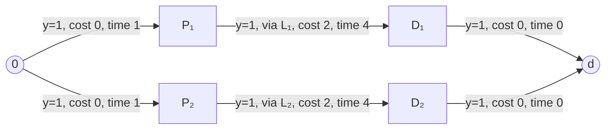
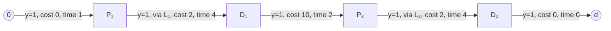
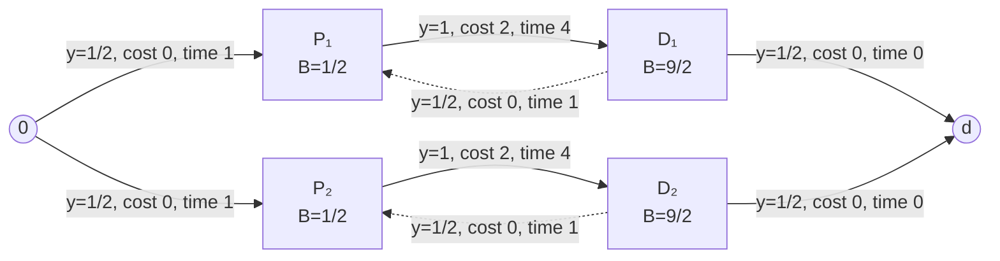

## SPDP Difficulty Analysis

The original-cost and duration formulations have the same integer feasible set, but their objectives expose fundamentally different parts of the LP relaxation. Let $X$ denote the integer feasible set of either the 2-index or the $p$-step formulation, and let $P\supseteq X$ denote its LP relaxation. For an edge-use vector $y$, or the edge-use vector induced by a $p$-step solution, define

$$
C(y)=\sum_{e\in E}\bar c_e y_e,
\qquad
K(y)=\sum_{\substack{e\in E:\,u_e=0\\v_e\in C^p}}y_e,
$$

where $\bar c_e$ excludes the vehicle fixed cost. Since the fixed cost $f$ is charged once on each actual depot departure, the original objective is

$$
F_f(y)=C(y)+fK(y).
\tag{1}
$$

For integer solutions, $K(y)$ is the number of routes. For fractional solutions, it is only the aggregate departure flow and need not represent any integer number of complete, state-consistent, duration-feasible routes. This distinction creates two separate sources of relaxation weakness.

### Layer 1: underestimation of the required route count

Let $k_{\min}$ be the minimum number of routes among integer feasible solutions. Every $y\in X$ satisfies

$$
K(y)\ge k_{\min}.
\tag{2}
$$

The basic LP relaxation need not satisfy (2). It can reduce the fractional flow on depot-departure edges, distribute flow over internal service-to-service edges, and combine several route structures fractionally while preserving the aggregate visit, state-flow, and time constraints. Consequently, it may admit

$$
K(y)<k_{\min}.
\tag{3}
$$

Under (1), this is directly rewarded by the fixed-cost term. Relative to an integer-feasible route count, a fractional solution with departure deficit $k_{\min}-K(y)$ saves

$$
f\bigl(k_{\min}-K(y)\bigr)
\tag{4}
$$

in fixed cost before accounting for the simultaneous change in $C(y)$. Since $f=500$ in the benchmark instances, even a modest fractional deficit can substantially depress the LP bound.

VI 44 removes precisely this first weakness:

$$
K(y)\ge k_{\min}.
\tag{5}
$$

Hence its large effect on the original-cost LP bound is structural rather than incidental: it excludes the part of the relaxation that obtains an artificial fixed-cost saving by using less departure flow than any feasible integer solution. The bound increase need not equal (4), because imposing (5) causes the LP to reoptimize both $C(y)$ and $K(y)$.

### Layer 2: conditional variable-cost gap at the selected route count

In the present SPDP, the virtual origin and destination arcs are free:

$$
t_{0v}=c_{0v}=0\quad(v\in C^p),
\qquad
t_{u,2n+1}=c_{u,2n+1}=0\quad(u\in C^d).
\tag{6}
$$

For a route $q$, let $D(q)$ and $C(q)$ denote its duration and variable transport cost, respectively.

**Proposition 1 (empty-state splitting).** Assume that the available fleet is sufficiently large and its cardinality is not fixed by equality. Let a feasible route $q$ contain two consecutive action nodes $u\in C^d$ and $v\in C^p$ such that the tractor is empty after serving $u$. Splitting $q$ at $(u,v)$ into $q^L$ ending at $u$ and $q^R$ starting at $v$ preserves feasibility and gives

$$
D(q^L)+D(q^R)=D(q)-t_{uv},
\tag{7}
$$

$$
C(q^L)+C(q^R)=C(q)-c_{uv}.
\tag{8}
$$

If $y$ and $y^{\mathrm{split}}$ are the edge-use vectors before and after the split, respectively, then

$$
F_f(y^{\mathrm{split}})-F_f(y)=f-c_{uv}.
\tag{9}
$$

**Proof.** The post-service state at $u$ and the initial state at $v$ are both empty. Replacing the internal connector $u\rightarrow v$ by the free arcs $u\rightarrow(2n+1)$ and $0\rightarrow v$ therefore preserves the action, state, and capacity requirements. Each child route is no longer than $q$, so the duration limit remains satisfied. The split removes exactly the connector time $t_{uv}$ and variable cost $c_{uv}$, proving (7) and (8). It also creates one additional route and hence one additional fixed charge, which proves (9). $\square$

Thus, under the variable-cost-only objective, every feasible split weakly improves the objective:

$$
C(y^{\mathrm{split}})=C(y)-c_{uv}\le C(y).
\tag{10}
$$

When the fleet is sufficiently large, applying repeated feasible splitting to a variable-cost-optimal solution yields an optimal solution with no splittable empty-state connector. Splitting may increase the number of routes, but route count is not penalized when $f=0$. In contrast, when $f>c_{uv}$, (9) makes the same split strictly unfavorable. In all 48 benchmark files, $f=500$ and every variable connector cost is at most 163, so each such split increases the original cost by at least 337. Variable-cost minimization and the benchmark fixed cost therefore favor, respectively, more separated and more consolidated route structures.

The opposing route-structure incentives imply that minimizing the number of routes and minimizing variable cost need not lead to the same integer solution. Let

$$
c^*=\min_{y\in X}C(y)
$$

denote the globally minimum variable cost. In particular, when the fixed cost selects $k_{\min}$ routes, there may be no integer solution satisfying both

$$
K(y)=k_{\min}
\qquad\text{and}\qquad
C(y)=c^*.
$$

The LP relaxation may nevertheless combine route structures fractionally and satisfy

$$
K(y)=k_{\min}
\qquad\text{and}\qquad
C(y)\le c^*.
$$

The central difficulty is therefore that the relaxation can conceal an incompatibility that is present in the integer problem and return a bound as if the minimum route count and the globally minimum variable cost could be attained simultaneously, or with an even smaller variable cost. To express this mismatch for a general feasible route count $k$, define

$$
\phi_{IP}(k)=\min\{C(y):y\in X,\ K(y)=k\},
\qquad
\phi_{LP}(k)=\min\{C(y):y\in P,\ K(y)=k\}.
\tag{11}
$$

The conditional integer penalty is

$$
\Delta_{IP}(k)=\phi_{IP}(k)-c^*\ge0,
\tag{12}
$$

with strict inequality exactly when no integer solution using $k$ routes attains the global minimum variable cost. For a given $f\ge0$, let

$$
k^*\in\arg\min_k\{\phi_{IP}(k)+fk\}
\tag{13}
$$

be a route count attained by an optimal fixed-cost integer solution. A sufficiently large fixed cost often gives $k^*=k_{\min}$, as in A8 and A9, but the following argument does not require that equality.

Suppose that

$$
\phi_{LP}(k^*)\le c^*<\phi_{IP}(k^*).
\tag{14}
$$

The LP then admits a fractional solution with aggregate departure flow $k^*$ and variable cost no greater than the globally optimal integer variable cost, although no $k^*$-route integer solution attains that cost. Since

$$
z_{IP}(f)=\phi_{IP}(k^*)+fk^*,
$$

$$
z_{LP}(f)\le\phi_{LP}(k^*)+fk^*\le c^*+fk^*,
$$

the fixed-cost integrality gap satisfies

$$
z_{IP}(f)-z_{LP}(f)
\ge\phi_{IP}(k^*)-\phi_{LP}(k^*)
\ge\Delta_{IP}(k^*)>0.
\tag{15}
$$

The conditional gap itself may close in two phases. Initially, $\phi_{LP}(k^*)$ can be strictly below $c^*$, keeping the fixed-cost bound below $c^*+fk^*$. Cuts and early branching may eliminate these weakest fractional solutions and raise the effective conditional LP bound to $c^*$. A residual gap nevertheless remains whenever

$$
c^*<\phi_{IP}(k^*).
$$

Closing it requires the solver to establish the valid implication

$$
y\in X,\quad K(y)=k^*
\quad\Longrightarrow\quad
C(y)\ge\phi_{IP}(k^*).
\tag{16}
$$

The aggregate equality $K(y)=k^*$ does not impose (16) on fractional solutions. For fractional $y$, $K(y)$ measures total departure flow rather than a number of complete routes and therefore does not ensure a decomposition into $k^*$ integral, state-consistent, duration-feasible paths. The 2-index big-$M$ constraints further weaken duration propagation on fractional edges. The $p$-step formulation strengthens local continuity, but fractional combinations of $p$-steps can still satisfy the aggregate visit, state, and time equations without forming $k^*$ feasible routes.

Branching on one edge may eliminate one such fractional realization while leaving alternative internal-edge combinations that reproduce a similar structure. Consequently, many descendant-node relaxations can continue to attain or approach

$$
K(y)\approx k^*,
\qquad
C(y)\approx c^*,
\tag{17}
$$

and the global dual bound can stagnate near $c^*+fk^*$.

#### Real instance example

The difficult instances A8 and A9 illustrate this progression. Here $f=500$ and $k^*=k_{\min}=2$.

| ID  | $c^*$ | $\phi_{IP}(2)$ | $\Delta_{IP}(2)$ | $c^*+2f$ | Fixed-cost optimum | Initial 2-index LP bound | Final 2-index bound | 2-index nodes |
| --- | ----: | -------------: | ---------------: | -------: | -----------------: | -----------------------: | ------------------: | ------------: |
| A8  |   301 |            314 |               13 |     1301 |               1314 |                 1298.110 |                1301 |     7,311,641 |
| A9  |   243 |            244 |                1 |     1243 |               1244 |                 1240.000 |                1243 |    15,441,660 |

In both cases, the initial 2-index bound was below $c^*+2f$ and was subsequently raised to that level, but no further global improvement was obtained after millions of branch-and-bound nodes. The remaining proof obligations were $C(y)\ge314$ and $C(y)\ge244$, respectively, over two-route integer solutions. VI 44 had already removed Layer 1, and generic cuts closed the remaining sub-gap from $\phi_{LP}(2)<c^*$ to $c^*$; nevertheless, the conditional gap from $c^*$ to $\phi_{IP}(2)$ persisted. The fixed cost does not change or weaken the feasible-set formulation itself; it selects a route-count region in which the relaxation cannot readily certify the required conditional variable-cost bound.

#### Simple example

The following two-request example shows how the compact 2-index relaxation can combine a small aggregate route count with the globally minimum variable cost, even though no integer solution can attain both simultaneously.

Consider two requests:

$$
r_1=(A,L_1,\tau),
\qquad
r_2=(B,L_2,\tau).
$$

Here $A$ and $B$ are recycling centers, $L_1$ and $L_2$ are treatment facilities, and both requests use the same container type $\tau$. Therefore, $P_1,D_1$ are located at $A$, while $P_2,D_2$ are located at $B$.

Let the service times and route-duration limit be

$$
s^p=s^e=s^d=1,
\qquad
T=11.
$$

The rows and columns of the following matrices represent physical locations, not multigraph nodes. The variable travel-cost matrix is

$$
\begin{array}{c|rrrr}
 &A&L_1&B&L_2\\ \hline
A   &0&1&10&10\\
L_1 &1&0&10&10\\
B   &10&10&0&1\\
L_2 &10&10&1&0
\end{array},
$$

and the travel-time matrix is

$$
\begin{array}{c|rrrr}
 &A&L_1&B&L_2\\ \hline
A   &0&1&1&1\\
L_1 &1&0&1&1\\
B   &1&1&0&1\\
L_2 &1&1&1&0
\end{array}.
$$

Thus, travel between the two distinct locations within either zone

$$
Z_1=\{A,L_1\},
\qquad
Z_2=\{B,L_2\}
$$

has variable cost one, whereas every movement between the two zones has variable cost 10.

Processing request $i$ through the multigraph edge

$$
P_i\to D_i
$$

with embedded treatment visit $L_i$ has variable cost

$$
1+1=2
$$

and duration

$$
1+s^e+1+s^d=4.
$$

A direct edge $D_1\to P_2$, or $D_2\to P_1$, crosses between $A$ and $B$. Its variable cost is 10 and its duration is

$$
1+s^p=2.
$$

As in the original SPDP, a route starts at its first pickup and ends at its last delivery. Hence

$$
(0,P_i):
\quad
\text{variable cost }0,
\quad
\text{duration }1,
$$

and

$$
(D_i,d):
\quad
\text{variable cost }0,
\quad
\text{duration }0.
$$

Since $P_i$ and $D_i$ are located at the same recycling center, the edge $D_i\to P_i$ has variable cost zero and duration

$$
0+s^p=1.
$$

The basic multigraph edge classes are summarized below, where $i,j\in\{1,2\}$ and $i\neq j$. Only state-feasible edges are included in the actual state-expanded multigraph.

$$
\begin{array}{c|c|c|c}
\text{edge}
&\text{embedded treatment}
&\text{variable cost}
&\text{duration}\\ \hline
0\to P_i
&-
&0
&1\\
P_i\to D_i
&L_i
&2
&4\\
D_i\to P_i
&-
&0
&1\\
P_i\to P_j
&-
&10
&2\\
P_i\to D_j
&-
&10
&2\\
D_i\to P_j
&-
&10
&2\\
D_i\to D_j
&-
&10
&2\\
D_i\to d
&-
&0
&0
\end{array}
\tag{18}
$$

The complete multigraph may contain additional state-specific or treatment-embedded parallel edges. The optimality arguments below use the underlying travel-cost matrix and therefore do not require such additional edges to be absent. Each figure displays only the edges carrying positive flow in the corresponding solution.

##### Variable-cost integer optimum

The two requests can be processed on separate routes.

Each route has duration

$$
1+4=5\le11,
$$

and the total variable cost is

$$
K(y)=2,
\qquad
C(y)=2+2=4.
$$

This value is globally optimal.

Any solution containing a movement between $Z_1$ and $Z_2$ incurs at least 10 units of cross-zone variable cost and is therefore more expensive than the displayed solution.

A solution without a cross-zone movement must process the two requests on separate routes. Processing each request requires travel from its recycling center to its treatment facility and then back to the recycling center. Therefore, each request incurs variable cost at least

$$
1+1=2.
$$

Every integer solution consequently satisfies

$$
C(y)\ge2+2=4,
$$

and the displayed solution attains this bound. Hence

$$
\boxed{
c^*=\phi_{\mathrm{IP}}(2)=4.
}
\tag{19}
$$

##### Integer optimum conditional on $K=1$

A one-route solution must serve both zones and must therefore cross between $Z_1$ and $Z_2$ at least once.

The following one-route solution crosses the zone boundary exactly once.

Its duration is

$$
1+4+2+4=11=T,
$$

and its variable cost is

$$
2+10+2=14.
$$

This solution is optimal among all one-route integer solutions.

A route crossing between the two zones at least twice incurs cross-zone variable cost of at least

$$
2(10)=20.
$$

Such a route is more expensive than the displayed solution and therefore cannot be optimal.

Consequently, an optimal one-route solution crosses the zone boundary exactly once. Before leaving the first zone, it must complete all actions belonging to the request in that zone. Otherwise, it would have to return to complete a remaining pickup, treatment, or delivery action, requiring a second cross-zone movement.

Every one-route solution must therefore incur at least

$$
\underbrace{2}_{\text{request in the first zone}}
+
\underbrace{10}_{\text{one cross-zone movement}}
+
\underbrace{2}_{\text{request in the second zone}}
=
14.
$$

The displayed route attains this lower bound. Hence

$$
\boxed{
\phi_{\mathrm{IP}}(1)=14.
}
\tag{20}
$$

The additional variable cost required to reduce the fleet from two vehicles to one is

$$
\phi_{\mathrm{IP}}(1)-c^*
=
14-4
=
10.
\tag{21}
$$

##### Fractional solution with $K(y)=1$

Now consider the following solution of the compact 2-index LP relaxation.

Set

$$
y_{0P_i}
=
y_{D_iP_i}
=
y_{D_id}
=
\frac12,
\qquad
y_{P_iD_i}=1,
\qquad i=1,2,
\tag{22}
$$

and set every other edge variable to zero.

At each pickup node,

$$
y_{0P_i}+y_{D_iP_i}
=
\frac12+\frac12
=
1
=
y_{P_iD_i}.
$$

At each delivery node,

$$
y_{P_iD_i}
=
1
=
\frac12+\frac12
=
y_{D_iP_i}+y_{D_id}.
$$

Thus all visit equations are satisfied.

The state-balance equations are also satisfied. Both positive-flow edges entering $P_i$ produce the same post-pickup state, while the positive-flow edges entering and leaving $D_i$ use the empty state.

The total depot-departure flow is

$$
K(y)
=
y_{0P_1}+y_{0P_2}
=
\frac12+\frac12
=
1.
\tag{23}
$$

The total return flow is also one:

$$
y_{D_1d}+y_{D_2d}=1.
$$

Therefore, depot balance is satisfied.

The equality $K(y)=1$ does not imply that the fractional solution consists of one complete route. It means only that its total depot-departure flow equals one.

##### Time feasibility of the fractional solution

Set

$$
B_{P_i}=\frac12,
\qquad
B_{D_i}=\frac92.
\tag{24}
$$

For the start edge $0\to P_i$,

$$
B_{P_i}
\ge
t_{0P_i}y_{0P_i}
=
1\left(\frac12\right)
=
\frac12.
$$

For the fully selected edge $P_i\to D_i$, the time-propagation constraint becomes

$$
B_{D_i}\ge B_{P_i}+4,
$$

which holds at equality:

$$
\frac92=\frac12+4.
$$

For the fractional edge $D_i\to P_i$, Table (18) gives a duration of one. The big-$M$ constraint is

$$
B_{P_i}
\ge
B_{D_i}+1-(T+1)(1-y_{D_iP_i}).
$$

Substituting $T=11$ and $y_{D_iP_i}=1/2$ gives

$$
\begin{aligned}
B_{P_i}
&\ge
\frac92+1-12\left(1-\frac12\right)\\
&=
-\frac12.
\end{aligned}
$$

Therefore, $B_{P_i}=1/2$ satisfies the constraint.

The return constraint is also satisfied because

$$
B_{D_i}+t_{D_id}y_{D_id}
=
\frac92
\le11.
$$

Hence the fractional solution satisfies all time constraints.

If $D_i\to P_i$ were selected integrally, the two internal time constraints would require

$$
B_{D_i}\ge B_{P_i}+4
$$

and

$$
B_{P_i}\ge B_{D_i}+1.
$$

Adding them gives

$$
0\ge5,
$$

which is impossible. Thus the positive-duration cycle

$$
P_i\to D_i\to P_i
$$

cannot appear in an integer solution. It survives fractionally because the big-$M$ term relaxes the second constraint when $y_{D_iP_i}=1/2$.

##### Variable cost of the fractional solution

Only the two treatment-and-delivery edges have positive flow and positive variable cost. Therefore,

$$
C(y)
=
2y_{P_1D_1}
+
2y_{P_2D_2}
=
4.
$$

Consequently,

$$
\boxed{
\phi_{\mathrm{LP}}(1)
\le4
=
c^*
<
14
=
\phi_{\mathrm{IP}}(1).
}
\tag{25}
$$

The compact LP has combined two properties that no integer solution can attain simultaneously:

$$
K(y)=1
\qquad\text{and}\qquad
C(y)=c^*=4.
$$

##### Effect of the vehicle fixed cost

Let the fixed cost per vehicle be

$$
f=11.
$$

The fixed cost is kept separate from the variable edge costs, so the objective is

$$
C(y)+fK(y).
$$

The two relevant integer objective values are

$$
\begin{aligned}
K=2:&\qquad 4+2(11)=26,\\
K=1:&\qquad 14+11=25.
\end{aligned}
$$

Thus adding the fixed cost changes the integer optimum from the two-route solution to the one-route solution.

The fractional solution has

$$
K(y)=1,
\qquad
C(y)=4,
$$

and therefore gives the LP value

$$
4+11=15.
$$

Once the one-route incumbent of 25 has been found, proving its optimality requires establishing

$$
K(y)=1
\quad\Longrightarrow\quad
C(y)\ge14.
\tag{26}
$$

Since all variable costs are integer, this is equivalent to proving that

$$
K(y)=1,
\qquad
C(y)\le13
\tag{27}
$$

has no integer solution.

The compact LP relaxation does not establish this conditional relationship: it admits a fractional solution with $K(y)=1$ and $C(y)=4$. The fixed cost does not weaken the relaxation itself. Instead, it directs the objective toward the small-$K$ region, thereby exposing a conditional variable-cost gap that is invisible to the aggregate route-count expression alone.

### Why the duration IP is comparatively easy

Let $D(y)$ denote total route duration, including travel and service times. Every feasible solution performs the same pickup, emptying, and delivery services, so total service duration is constant and only travel duration distinguishes feasible solutions. The duration formulation minimizes

$$
\min_{y\in X}D(y)
\tag{28}
$$

and contains no term $fK(y)$. Therefore, Layer 1 is not objective-relevant: a fractional reduction of $K(y)$ below $k_{\min}$ yields no direct saving analogous to (4). VI 44 remains valid, but violating it receives no direct objective reward in the basic duration relaxation.

The fixed-cost mechanism in Layer 2 is also inactive. Duration minimization does not select a small route count and then require the conditional certificate (16). Instead, Proposition 1 gives

$$
D(y^{\mathrm{split}})=D(y)-t_{uv}\le D(y),
\tag{29}
$$

so feasible splitting is never penalized. With a sufficiently large fleet, repeated splitting yields a duration-optimal solution with every splittable empty connector removed; a positive-time connector cannot occur in an optimum, while a zero-time connector can be removed without changing its value. The same argument applies to travel-cost-only minimization through (10).

This explains why the basic duration formulation can solve the present instances rapidly even without VI 44, whereas the original-cost formulation may remain difficult after VI 44 has removed Layer 1. It does not imply that duration minimization is polynomial, that its LP relaxation is always integral, or that it must be easier on every instance;
### Experimental evidence

#### Duration vs Original Cost

The two objectives were compared using the direct binary 2-index formulation ($p=0$) with VI 44. For every instance, the resulting MILP models differed only in their objective coefficients. The reported time is the main MILP runtime and excludes the common preprocessing used to determine the right-hand side of VI 44.

Let $K_D$ and $K_C$ denote the vehicle counts in the duration-optimal solution and the incumbent returned by the original-cost run, respectively. The original-cost objective value is denoted by $\bar C$. A superscript $^*$ marks an incumbent whose optimality was not proved within the time limit.

| ID  | $\mathcal I$ | $D^*$ | $K_D$ | Duration time (s) | Duration nodes |  $\bar C$ | $K_C$ | Cost gap (%) | Cost time (s) | Cost nodes |
| --- | -----------: | ----: | ----: | ----------------: | -------------: | --------: | ----: | -----------: | ------------- | ---------- |
| A1  |            5 |   259 |     2 |              0.02 |              1 |       648 |     1 |         0.00 | 0.02          | 1          |
| A2  |            7 |   291 |     3 |              0.16 |              1 |       625 |     1 |         0.00 | 0.16          | 1          |
| A3  |            7 |   274 |     3 |              0.07 |              1 |       619 |     1 |         0.00 | 0.04          | 1          |
| A4  |           10 |   414 |     4 |              0.29 |              1 |       695 |     1 |         0.00 | 0.21          | 1          |
| A5  |           10 |   424 |     5 |              0.19 |              1 |       707 |     1 |         0.00 | 8.84          | 19,116     |
| A6  |           12 |   482 |     3 |              0.05 |              1 |     1,201 |     2 |         0.00 | 0.14          | 112        |
| A7  |           12 |   499 |     3 |              1.28 |              1 |     1,210 |     2 |         0.00 | 0.31          | 1          |
| A8  |           15 |   628 |     7 |              0.09 |              1 | 1,314$^*$ |     2 |         0.99 | 1,800.08      | 7,311,641  |
| A9  |           15 |   578 |     5 |              0.21 |              1 | 1,244$^*$ |     2 |         0.08 | 1,800.02      | 15,441,660 |
| A10 |           20 |   737 |     9 |              2.47 |              1 |     1,297 |     2 |         0.00 | 11.37         | 3,893      |
| A11 |           20 |   730 |     7 |              0.89 |              1 |     1,282 |     2 |         0.00 | 0.72          | 1          |
| B1  |           18 |   656 |     5 |              0.81 |              1 | 1,291$^*$ |     2 |         0.39 | 1,800.03      | 2,557,080  |
| B2  |           18 |   548 |     6 |              2.31 |              1 |     1,118 |     2 |         0.00 | 1.51          | 1          |
| C1  |           10 |   544 |     3 |              0.44 |            397 |     1,297 |     2 |         0.00 | 0.04          | 1          |
| C2  |           10 |   626 |     5 |              0.27 |              1 |     1,438 |     2 |         0.00 | 1.95          | 1,601      |
| C3  |           16 | 1,116 |     5 |              1.81 |            353 |     2,269 |     3 |         0.00 | 6.21          | 2,508      |
| C4  |           18 |   902 |    10 |              0.76 |              1 | 1,495$^*$ |     2 |         1.40 | 1,800.20      | 4,453,560  |

The original-cost model required approximately 3.1 times the runtime and 35.8 times the branch-and-bound nodes even after excluding the four time-limit cases.

The solution structures also agree with the splitting argument. The duration-optimal solutions use more vehicles in every instance: $\sum K_D=85$ versus $\sum K_C=30$ for the reported original-cost incumbents. In 14 instances, this additional splitting strictly reduces total duration. For A1, B2, and C1, the two reported solutions have the same total duration but the duration optimum uses more vehicles.

These results support the proposed structural explanation, but they do not isolate the fixed-cost effect completely **because the two objectives also use different variable metrics: travel time and travel distance.** The following ablation therefore compares duration with variable transport cost alone.

#### Duration vs. Travel Cost Only

To separate the effect of the travel metric from that of the fixed vehicle cost, duration was compared with variable transport cost alone,

$$
c(y)=\sum_{e\in E}c_e y_e,
$$

using the same direct 2-index formulation and VI 44. Let $y_D$ and $y_{\mathrm{tr}}$ denote the solutions obtained under duration and travel-cost-only minimization, respectively. Both experiments finished in less than six seconds per instance, so their different nominal time limits did not censor the comparison.

| ID  | $D^*$ | $c(y_D)$ | $K_D$ | Duration time (s) | Duration nodes | $c^*$ | $D(y_{\mathrm{tr}})$ | $K_{\mathrm{tr}}$ | Travel-cost time (s) | Travel-cost nodes |
| --- | ----: | -------: | ----: | ----------------: | -------------: | ----: | -------------------: | ----------------: | -------------------: | ----------------: |
| A1  |   259 |      148 |     2 |              0.02 |              1 |   148 |                  259 |                 2 |                 0.02 |                 1 |
| A2  |   291 |      137 |     3 |              0.16 |              1 |   125 |                  318 |                 2 |                 0.07 |                 1 |
| A3  |   274 |      124 |     3 |              0.07 |              1 |   119 |                  288 |                 3 |                 0.04 |                 1 |
| A4  |   414 |      212 |     4 |              0.29 |              1 |   195 |                  420 |                 4 |                 0.36 |                 1 |
| A5  |   424 |      208 |     5 |              0.19 |              1 |   200 |                  439 |                 4 |                 0.63 |                 1 |
| A6  |   482 |      206 |     3 |              0.05 |              1 |   200 |                  490 |                 5 |                 0.04 |                 1 |
| A7  |   499 |      224 |     3 |              1.28 |              1 |   210 |                  511 |                 4 |                 0.25 |                 1 |
| A8  |   628 |      304 |     7 |              0.09 |              1 |   301 |                  629 |                 7 |                 0.17 |                 1 |
| A9  |   578 |      255 |     5 |              0.21 |              1 |   243 |                  604 |                 7 |                 0.38 |                 1 |
| A10 |   737 |      301 |     9 |              2.47 |              1 |   297 |                  738 |                 8 |                 5.35 |               286 |
| A11 |   730 |      298 |     7 |              0.89 |              1 |   282 |                  753 |                 7 |                 0.95 |                 1 |
| B1  |   656 |      287 |     5 |              0.81 |              1 |   283 |                  673 |                 5 |                 0.35 |                 1 |
| B2  |   548 |      118 |     6 |              2.31 |              1 |   118 |                  549 |                 7 |                 1.26 |                 1 |
| C1  |   544 |      297 |     3 |              0.44 |            397 |   297 |                  547 |                 2 |                 0.05 |                 1 |
| C2  |   626 |      416 |     5 |              0.27 |              1 |   407 |                  633 |                 5 |                 0.15 |                 1 |
| C3  | 1,116 |      772 |     5 |              1.81 |            353 |   769 |                1,125 |                 4 |                 2.80 |               870 |
| C4  |   902 |      480 |    10 |              0.76 |              1 |   474 |                  903 |                 6 |                 1.55 |                 1 |

Both objectives were solved to optimality for all 17 instances, and 15 instances were solved at the root node under each objective. Total runtime was 12.12 seconds for duration and 14.42 seconds for travel cost only. Thus, on these instances, replacing travel time with travel distance does not materially change computational difficulty.

Combined with the structural analysis above, this result provides direct empirical support for the role of splitting dominance. Without a fixed vehicle cost, both objectives retain the empty-connector splitting dominance, so merged block sequences can be excluded without loss of optimality. The fixed vehicle cost instead makes time-feasible merging beneficial and thereby removes or reverses this dominance-based reduction of the sufficient search space. The observed difficulty of the original objective is therefore better explained by the merging incentive induced by the fixed vehicle cost than by the difference between the travel-time and travel-distance metrics.

#### Instance classification by the conditional variable-cost gap

The computational status of all 48 instances can be summarized using

$$
\Delta_{\mathrm{IP}}(k_{\min})
=
\phi_{\mathrm{IP}}(k_{\min})-c^*
\ge0,
$$

where $c^*$ is the global travel-cost-only optimum and $\phi_{\mathrm{IP}}(k_{\min})$ is the minimum variable cost among integer solutions using exactly $k_{\min}$ routes.

The fixed-$k_{\min}$ preprocessing problem proved $\phi_{\mathrm{IP}}(k_{\min})$ for 33 instances. The diagnostic cut was therefore applied, and **every resulting main problem was solved at the root node.** Among these instances, 28 satisfy

$$
\phi_{\mathrm{IP}}(k_{\min})=c^*,
$$

whereas five have a strictly positive conditional variable-cost gap:

| ID | $c^*$ | $\phi_{\mathrm{IP}}(k_{\min})$ | $\Delta_{\mathrm{IP}}(k_{\min})$ |
| --- | ---: | ---: | ---: |
| A5 | 200 | 207 | 7 |
| A6 | 200 | 201 | 1 |
| B3 | 146 | 147 | 1 |
| B4 | 140 | 141 | 1 |
| C2 | 407 | 438 | 31 |

The preprocessing problem did not prove $\phi_{\mathrm{IP}}(k_{\min})$ for the remaining 15 instances. Nevertheless, the subsequent uncut main problem solved A17 and C11 to optimality, and both optimal solutions use $K=k_{\min}$. Hence

$$
z^*=\phi_{\mathrm{IP}}(k_{\min})+fk_{\min}.
$$

With $f=500$, A17 has $z^*=2101$ and $k_{\min}=3$, while C11 has $z^*=4632$ and $k_{\min}=6$. Therefore,

$$
\phi_{\mathrm{IP}}(3)
=2101-3(500)
=601
=c^*
\qquad\text{for A17},
$$

and

$$
\phi_{\mathrm{IP}}(6)
=4632-6(500)
=1632
=c^*
\qquad\text{for C11}.
$$

The uncut main problem did not prove optimality for the other 13 instances. For A8 and A9, however, the integer-equivalent $p=2$ original-cost formulation was solved to optimality. The certified optimal solutions both use two routes, with objective values 1314 and 1244, respectively. Applying the same argument gives

$$
\phi_{\mathrm{IP}}(2)
=1314-2(500)
=314
>301
=c^*
\qquad\text{for A8},
$$

and

$$
\phi_{\mathrm{IP}}(2)
=1244-2(500)
=244
>243
=c^*
\qquad\text{for A9}.
$$

Thus the final upper bounds found by the uncut $p=0$ runs for A8 and A9 were already optimal; those runs failed because their lower bounds did not reach the incumbent values, not because they failed to find an optimal incumbent.

For the remaining 11 instances, let $\overline\phi_{\mathrm{IP}}(k_{\min})$ denote the variable cost of the best known feasible $k_{\min}$-route solution. It is only an upper bound on the conditional optimum, so

$$
0
\le
\Delta_{\mathrm{IP}}(k_{\min})
\le
\overline\phi_{\mathrm{IP}}(k_{\min})-c^*.
$$

| ID | $c^*$ | $\overline\phi_{\mathrm{IP}}(k_{\min})$ | Candidate gap |
| --- | ---: | ---: | ---: |
| A13 | 375 | 378 | 3 |
| A15 | 548 | 553 | 5 |
| B1 | 283 | 291 | 8 |
| B5 | 141 | 143 | 2 |
| B6 | 166 | 171 | 5 |
| B8 | 188 | 192 | 4 |
| C4 | 474 | 495 | 21 |
| C6 | 989 | 1004 | 15 |
| C8 | 1019 | 1027 | 8 |
| C9 | 1417 | 1431 | 14 |
| C12 | 1299 | 1300 | 1 |

These candidate gaps must not be interpreted as exact values. In particular, equality remains possible whenever the available conditional lower bound is $c^*$.

Overall, $\phi_{\mathrm{IP}}(k_{\min})$ is known exactly for 37 of the 48 instances. Among these, 30 satisfy $\phi_{\mathrm{IP}}(k_{\min})=c^*$ and seven have a strictly positive gap. The conditional optimum remains unknown for the other 11 instances. 

