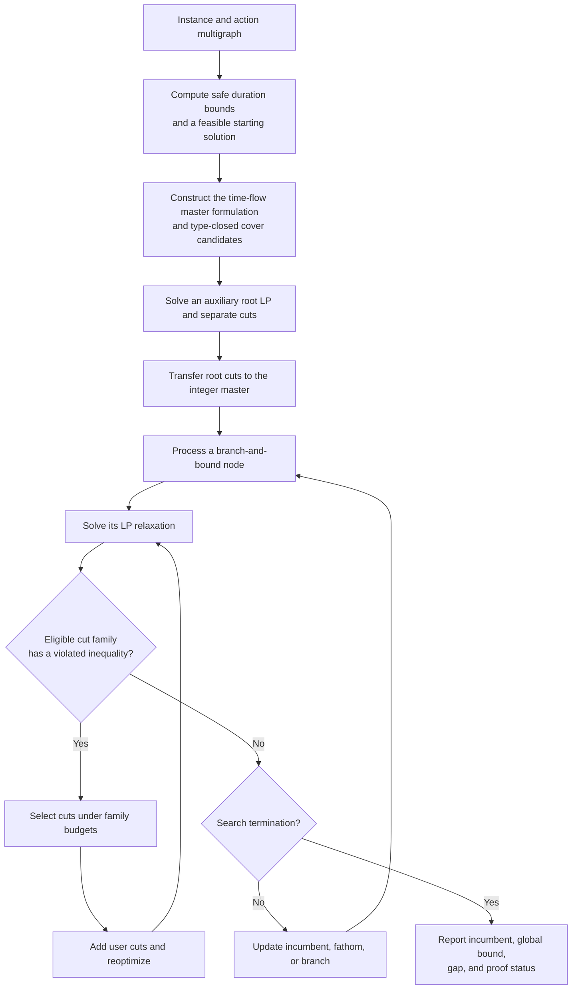

# Branch-and-cut algorithm

We solve the action-based two-index formulation of the skip pickup and delivery problem with objective $C(y)+fK(y)$, where $y_e$ indicates whether multigraph arc $e$ is used, $C(y)$ is travel cost, and $K(y)$ counts vehicle departures. The main formulation enforces route duration through a node-state time-flow extension; its integer feasible solutions satisfy the duration limit $T$. The algorithm strengthens its LP relaxations with two families of valid inequalities: capacity odd-set inequalities and type-closed duration-cover inequalities.

## Algorithmic flow

*Figure 1. Root strengthening followed by cut separation within branch-and-bound. The current procedure also separates at the integer master's root after the auxiliary LP; the auxiliary root LP may be omitted without changing the cut families.*

## Bounds and cut families

**Global route-count bound.** A duration-minimization integer program and other valid workload bounds yield a certified lower bound $k_{\mathrm{LB}}$ on the number of routes. The master includes $K(y)\ge k_{\mathrm{LB}}$; it does not fix the fleet size. The duration subproblem uses a compact time formulation and may stop as soon as its lower and feasible upper duration bounds yield the same value after division by $T$ and upward rounding. A separate feasible-solution search starts from $k_{\mathrm{LB}}$ and, when successful, supplies validated routes as an initial incumbent. Neither auxiliary computation uses the master's time-flow extension.

**Capacity odd-set cuts.** Let $N^P$ and $N^D$ be the pickup and delivery action sets. For either family $F\in\{N^P,N^D\}$ and every odd $S\subseteq F$ with $|S|\ge3$, define $E_F(S)$ as multigraph arcs whose endpoints both lie in $S$. The active inequality is

$$
\sum_{e\in E_F(S)}y_e\le\frac{|S|-1}{2}.
$$

It rules out fractional internal connections that cannot be realized by the capacity-two route structure. At a relaxation $\bar y$, parallel arcs are aggregated into an auxiliary matching graph, and an odd-cut search based on Padberg–Rao/Gomory–Hu generates candidate sets. Candidate violations are recomputed from the original $\bar y$. Pickup and delivery candidates share one capacity-cut budget.

**Type-closed duration-cover cuts.** For any union $H$ of container types, let $S_H$ contain *all* pickup and delivery actions of those types. Restrict demand to $H$, retain every legal treatment facility, and replace physical travel times by shortest-path travel times. If $L_H$ is a certified lower bound on the minimum **total route duration** of this restricted problem, then

$$
\rho_H=\left\lceil\frac{L_H}{T}\right\rceil,\qquad
\sum_{e\in\delta^-(S_H)}y_e\ge\rho_H.
$$

The type closure makes projection of each global route onto $H$ feasible, while metric closure prevents the restricted travel time from exceeding the projected travel time. Thus the row remains valid even when the restricted integer program stops before proving its optimum: its safe lower bound is sufficient. Rows are generated before the main search; separation only evaluates the as-yet-unadded rows at the current $\bar y$. The current policy retains $\rho_H\ge2$ and omits the union of all types, which is handled by the global route-count bound.

## Cut selection and management

The two families use the **same policy structure but independent counters and limits**. Let $q\in\{B,T\}$ denote capacity blossom and type cover, respectively. A separation round is one eligible evaluation of family $q$ at an optimal LP relaxation. Let $A_q$ be its cumulative cuts, $A_q^R$ its cumulative root cuts, $R_q$ its rounds at the *current* root stage, $S_q$ its cumulative separation time, and $\tau$ the main MIP solver runtime. Ineligible families are skipped before candidate generation. The current limits are:

| Rule, applied separately to each family | Capacity $B$ | Duration cover $T$ |
| --- | ---: | ---: |
| Maximum root rounds per root stage | 20 | 20 |
| Maximum root cuts across root stages | 256 | 256 |
| Maximum cuts in one root round | 32 | 8 |
| Maximum cuts in one tree-node round | 8 | 4 |
| Maximum cuts over the entire solve | 2,000 | 2,000 |
| Minimum strict violation $\varepsilon_q$ | $10^{-4}$ | $10^{-4}$ |
| Maximum within-round Jaccard overlap $\gamma_q$ | 0.9 | 0.9 |
| Consecutive empty root rounds before closure | 2 | 2 |
| Consecutive root rounds with best accepted violation $<0.02$ before closure | 2 | 2 |
| Dense tree region / later node period | $n<50$ / every 100th node | $n<50$ / every 100th node |
| Maximum tree separation-time share | 0.15 | 0.15 |

**Eligibility and budget.** At the root, family $q$ is open only while $R_q<20$, $A_q^R<256$, and $A_q<2000$, and neither root streak has closed it. The number of cuts that can be accepted in that round is

$$
b_q^R=\min\{m_q^R,\;256-A_q^R,\;2000-A_q\},
\qquad(m_B^R,m_T^R)=(32,8).
$$

At a tree node, the root closure does *not* close tree separation. In the current adaptive schedule, node number $n$ is eligible if $n<50$ or $n$ is a multiple of 100; a root-only policy would disable tree separation, whereas a full-tree policy would inspect every node. The tree budget is

$$
b_q^N=\min\{m_q^N,\;2000-A_q\},
\qquad(m_B^N,m_T^N)=(8,4).
$$

Tree separation closes permanently for family $q$ once $A_q\ge2000$ or, after $\tau>5$ seconds, $S_q>0.15\,\tau$. This time-share test is **not applied at the root**. In the current two-stage root procedure, $S_q$ includes separation performed in the auxiliary LP, whereas $\tau$ is the main MIP runtime; this detail can cause early closure in the tree. The full instance wall-clock limit and the auxiliary LP phase limit are separate budgets.

**Candidate filtering.** For each eligible family, consider only rows with *strict* violation greater than $\varepsilon_q$ at $\bar y$. Rank candidates by violation and accept at most the round budget. Previously added type-cover rows and previously emitted blossom sets are excluded. Within a round, reject a candidate set $S$ when its Jaccard index with an accepted set of the same cut family exceeds $\gamma_q$; for blossom cuts this comparison is additionally restricted to the same pickup or delivery action family. There is no overlap filter *between* blossom and type-cover cuts. The best violation used for the root stopping test is the maximum among **accepted** cuts, or zero if none is accepted.

**Root stopping and handoff.** After each eligible root round, increment $R_q$, $A_q^R$, and $A_q$ by the appropriate amounts. Consecutive rounds with no accepted cut increment an empty-round streak; any round with a cut resets it. Independently, a round whose best accepted violation is strictly below 0.02 increments a low-violation streak; otherwise that streak resets. Reaching two in either streak closes root separation for that family, without closing its tree separation. The auxiliary LP is reoptimized after a round with at least one new cut and ends when both families return no cuts, its phase time expires, or the LP ceases to be optimal. Therefore it can end after **one** empty joint round, even though each family's root stopping threshold is two. The current procedure then opens a new root stage at the main integer master: it resets root-round and streak counters, but retains cumulative cut counts and the pools of already added cuts. Root separation can consequently continue there.

All accepted inequalities are valid for integer routes; selection thresholds and stopping rules affect bound quality and runtime, not the feasible integer set. Optimality is claimed only when branch-and-bound proves the incumbent equals the global bound. Otherwise the incumbent, valid solver bound, and remaining gap are reported separately.
